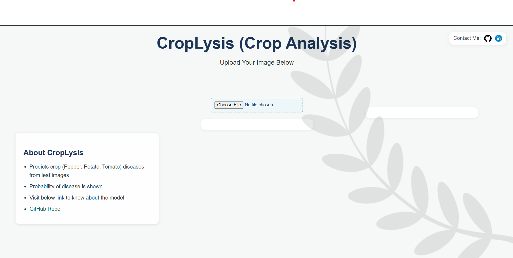

# 🌿 CropLysis — AI-Powered Crop Disease Detection

**CropLysis** (Crop Analysis) is a full-stack AI web application that detects crop diseases from leaf images.  
It combines a deep-learning backend with a modern, responsive frontend to provide fast and accurate plant disease diagnosis.

---

## 🖼️ Project Preview

### 🌾 Frontend Interface  
Upload a leaf image through an intuitive, minimal interface. 

### 🌿 Prediction Results  
After uploading, the system displays the detected disease and its confidence score. 

---

## 🚀 Project Overview

CropLysis demonstrates the integration of **machine learning**, **web development**, and **cloud deployment**.  
Users upload a photo of a leaf, and the backend model identifies the disease category with prediction confidence.  
Currently, the model is trained on predicting for Tomato, Pepper, and Potato, and for the diseases listed below:
    - Pepper Bell Bacterial Spot
    - Pepper Bell Healthy
    - Potato Early Blight
    - Potato Healthy
    - Potato Late Blight
    - Tomato Target Spot
    - Tomato Mosaic Virus
    - Tomato Yellow Leaf Curl Virus
    - Tomato Bacterial Spot
    - Tomato Early Blight
    - Tomato Healthy
    - Tomato Late Blight
    - Tomato Leaf Mold
    - Tomato Septoria Leaf Spot
    - Tomato Spider Mites
The goal is to make AI-driven crop disease analysis accessible to farmers and agricultural experts worldwide.

---

## 🧩 Architecture and Workflow

1. **Frontend (Vercel)** — Built using **React + Vite**, hosted on **Vercel** for a fast global CDN experience.  
2. **Backend (AWS EC2)** — Powered by **FastAPI**, containerized using **Docker** for reliability and easy deployment.  
3. **Reverse Proxy (Nginx)** — Forwards traffic securely from the public domain to the backend container.  
4. **Cloudflare DNS** — Handles SSL certificates and HTTPS routing for secure communication.  
5. **Data Flow:**  
   - The user uploads a leaf image from the frontend.  
   - The image is sent to the FastAPI endpoint.  
   - The trained CNN model analyzes the image and returns JSON predictions.  
   - The frontend renders the results dynamically on screen.

---

## ⚙️ Technology Stack

| Layer | Tools / Frameworks |
|:------|:--------------------|
| **Frontend** | React, Vite, JavaScript, HTML, CSS |
| **Backend** | FastAPI, Python, Uvicorn |
| **Model** | Custom Convolutional Neural Network (CNN) |
| **Containerization** | Docker |
| **Server & Proxy** | AWS EC2, Nginx |
| **Hosting & DNS** | Vercel (frontend), Cloudflare (SSL/DNS) |

---

## 🌐 Live Components

- 🌾 **Frontend:** [https://croplysis.karkiujjwal.com.np](https://croplysis.karkiujjwal.com.np)  
- 🧠 **Backend API:** [https://croplysismain.karkiujjwal.com.np/predict](https://croplysismain.karkiujjwal.com.np/predict)

### <u>Note: Backend API might not work until I start the EC2 Instance</u>

---

## 🧠 Key Learnings and Outcomes

- Developed a production-ready AI application combining ML and web technologies.  
- Managed **CORS**, **SSL**, and secure domain integration between separate hosts.  
- Learned real-world **Docker**, **Nginx**, and **AWS EC2** deployment pipelines.  
- Completed a full workflow — from model training to a polished user interface.

---

## 💡 Future Enhancements

- Add support for multiple crops and disease categories.  
- Provide treatment suggestions and external references.  
- Develop a **mobile app** version for offline use.  
- Include an **analytics dashboard** for tracking prediction trends.

---

## 👨‍💻 Author

**Ujjwal Karki**  
Bachelor’s Student • ML Engineering Enthusiast  
 
🌐 [Portfolio](https://karkiujjwal.com.np) &nbsp;|&nbsp; 🐙 [GitHub](https://github.com/ujjwalkarkeyy)

---